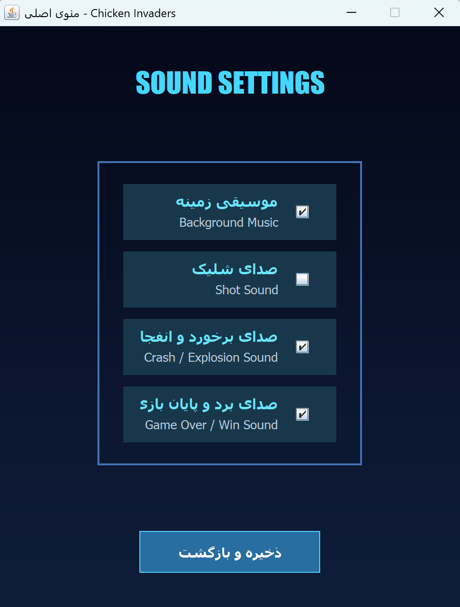

# Chicken Invaders

<p align="center">
  A desktop arcade game developed with Java Swing and SQLite
</p>

<p align="center">
  
  
  
  
</p>

---

## About the Project

**Chicken Invaders** is a desktop arcade game inspired by the classic Chicken Invaders series.

The project was developed in Java as an Object-Oriented Programming course project. It combines graphical user interface development, game-loop implementation, object-oriented design, user authentication, and persistent data storage.

Players can select different aircraft, fight several types of enemies and bosses, collect power-ups, purchase aircraft from the store, and compete for higher scores.

---

## Features

- User registration, login, and logout
- Multiple playable aircraft with different characteristics
- Several enemy types with different movement patterns and behaviors
- Multi-level gameplay
- Boss battles
- Player lives and score management
- Multiple shooting levels
- Rapid-fire and shield power-ups
- In-game aircraft store
- Persistent high-score leaderboard
- Sound and music settings
- Keyboard-based player controls
- SQLite-based data persistence
- Graphical user interface developed with Java Swing

---

## Technologies

| Technology | Usage |
|---|---|
| Java | Core application and game logic |
| Java Swing | Graphical user interface |
| SQLite | Persistent data storage |
| JDBC | Database communication |
| Git and GitHub | Version control |
| Object-Oriented Programming | Project design and implementation |

---

## Screenshots

<table>
  <tr>
    <td align="center">
      <strong>Main Menu</strong><br><br>
      
    </td>
    <td align="center">
      <strong>Gameplay</strong><br><br>
      
    </td>
  </tr>

  <tr>
    <td align="center">
      <strong>Boss Fight</strong><br><br>
      
    </td>
    <td align="center">
      <strong>Aircraft Store</strong><br><br>
      
    </td>
  </tr>

  <tr>
    <td align="center">
      <strong>High Scores</strong><br><br>
      
    </td>
    <td align="center">
      <strong>Sound Settings</strong><br><br>
      
    </td>
  </tr>
</table>

---

## Main Game Components

### Player Aircraft

The player can select and use different aircraft. Each aircraft has its own gameplay characteristics, including movement speed, number of lives, and shooting cooldown.

The game also supports:

- Increasing fire level
- Multiple simultaneous bullets
- Rapid-fire mode
- Temporary shield protection
- Aircraft purchasing through the store

### Enemies

The game contains several enemy types with different attributes and movement behaviors, including:

- Normal enemies
- Fast enemies
- Shooter enemies
- Zigzag enemies

Enemy strength can change according to the current game level.

### Bosses

Boss battles appear at specific stages of the game. Bosses have:

- Higher health
- Separate movement patterns
- Special attacks
- A visible health bar
- Level-dependent behavior

### Grid System

Enemies are managed through a grid-based positioning system. Each grid cell keeps track of its position, assigned enemy, and remaining lives.

### Database

SQLite is used to store persistent application data, including:

- User accounts
- Authentication information
- High scores
- Player-related information

Database operations are performed through JDBC.

---

## Object-Oriented Design

The project applies Object-Oriented Programming concepts such as:

- Encapsulation
- Inheritance
- Abstraction
- Polymorphism
- Separation of responsibilities

Common enemy behavior is placed in an abstract base class, while specialized enemy and boss classes implement their own movement and attack logic.

The user interface, game entities, database operations, and game-management responsibilities are separated into different classes and packages.

---

## How to Run

### Prerequisites

Before running the project, make sure the following software is installed:

- Java Development Kit
- IntelliJ IDEA or another Java IDE
- SQLite JDBC driver

### Installation

1. Clone the repository:

```bash
git clone https://github.com/ArmitaAlimardani/Chicken-invaders.git
```

2. Open the cloned project in IntelliJ IDEA.

3. Make sure the required SQLite JDBC dependency is available.

4. Check that the database file and application resources are located in their expected project directories.

5. Find and run the main application class.

---

## Controls

The game is controlled using the keyboard.

The player can:

- Move the aircraft
- Shoot enemies
- Pause or continue the game
- Return to the previous screen when supported

---

## Skills Demonstrated

This project demonstrates practical experience in:

- Java programming
- Desktop application development
- Java Swing
- Object-Oriented Programming
- Game-loop implementation
- Event handling
- Collision detection
- Database design
- JDBC and SQLite integration
- User authentication
- State and score management
- Code refactoring
- Clean Code principles
- Git and GitHub

---

## Possible Future Improvements

- Adding automated tests
- Improving database security
- Adding more levels and boss types
- Adding additional aircraft and power-ups
- Improving animation effects
- Adding difficulty settings
- Packaging the project as an executable application

---

## Author

**Armita Alimardani**

Computer Science Student  
Amirkabir University of Technology

GitHub: [ArmitaAlimardani](https://github.com/ArmitaAlimardani)
