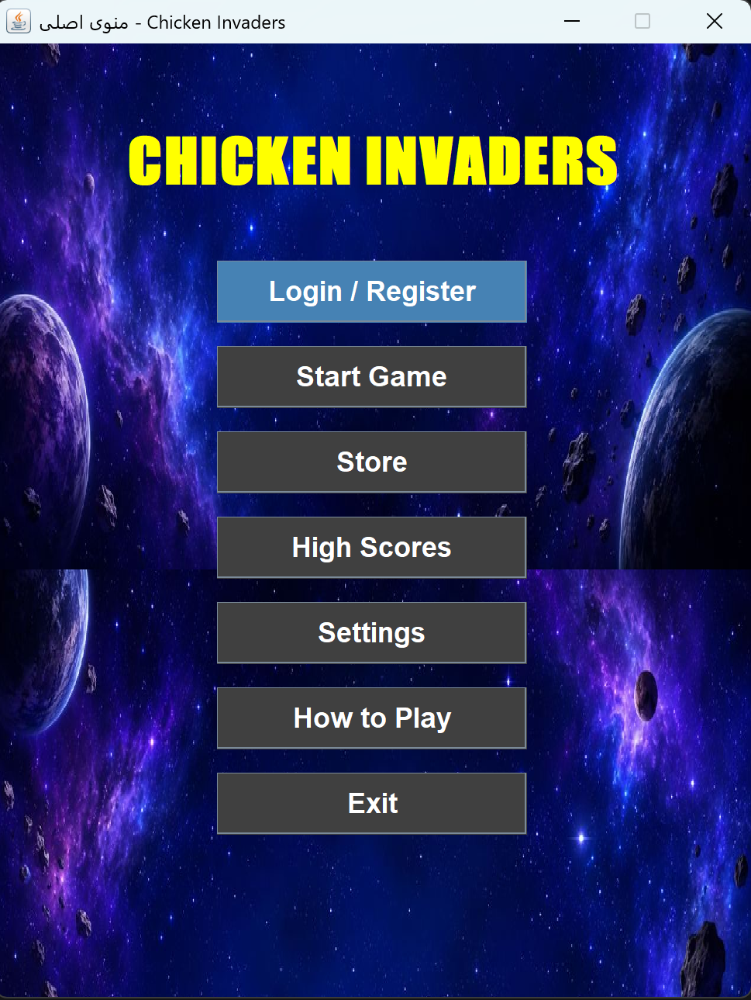
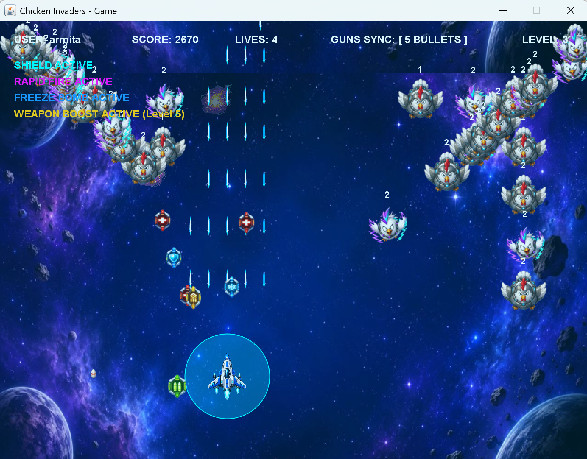
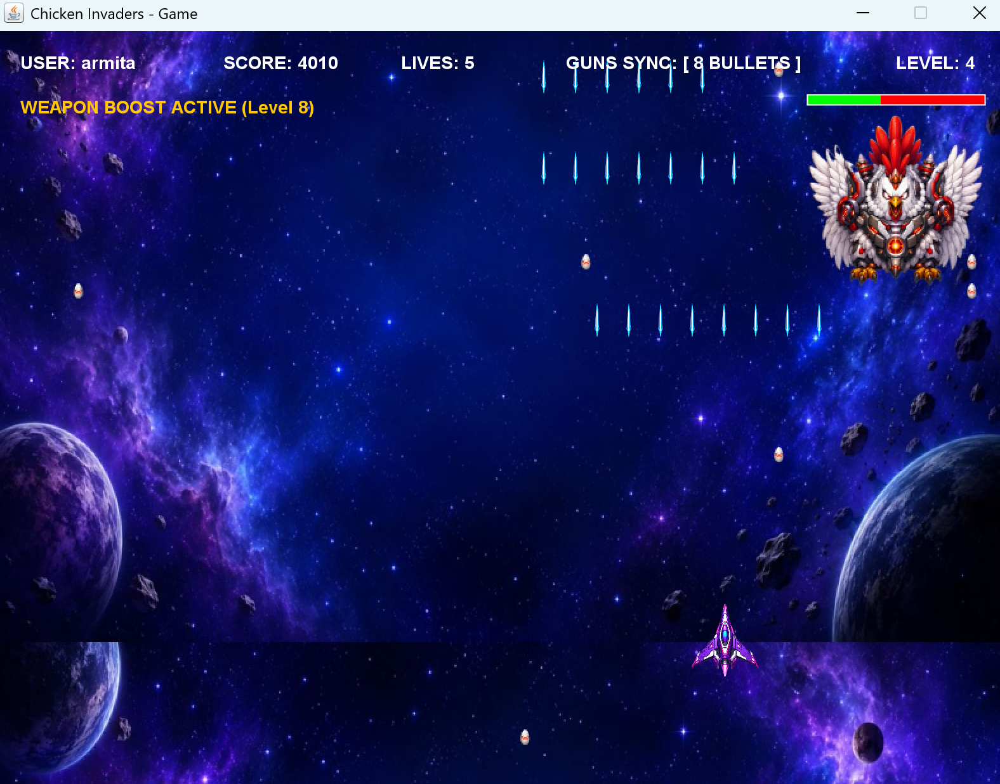
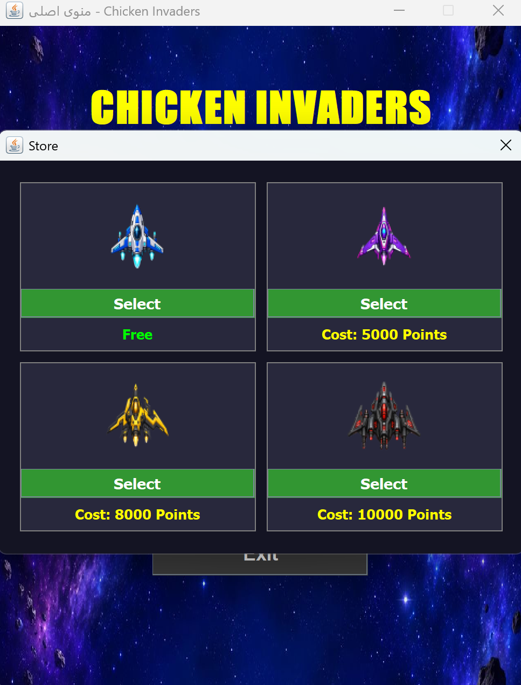
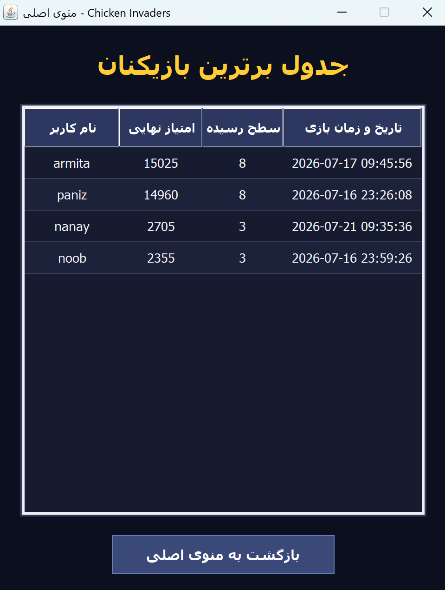

#  Chicken Invaders

A desktop arcade game inspired by the classic **Chicken Invaders**, developed in **Java** using **Swing** and **SQLite**.

This project was developed as the final project of the Object-Oriented Programming course at Amirkabir University of Technology. The game includes user authentication, persistent score management, multiple enemy types, bosses, power-ups, an in-game store, and customizable settings.

---

#  Features

- User registration and login
- Three playable aircraft with different abilities
- Multiple enemy types with unique behaviors
- Boss battles
- Power-up system
- In-game store
- High score leaderboard
- Sound settings
- Persistent game data using SQLite
- Object-Oriented architecture
- Clean Code principles

---

#  Technologies

- Java
- Java Swing
- SQLite
- JDBC
- Object-Oriented Programming (OOP)

---

#  Screenshots

## Main Menu



---

## Gameplay



---

## Boss Fight



---

## Store



---

## High Scores



---

#  Project Structure

```
src/
├── controller
├── model
├── view
├── database
├── utility
└── ...
```

---

#  How to Run

1. Clone the repository

```
git clone https://github.com/ArmitaAlimardani/Chicken-invaders.git
```

2. Open the project in IntelliJ IDEA

3. Make sure SQLite database is available

4. Run the Main class

---

#  Database

The game uses **SQLite** for storing:

- User accounts
- High scores
- Game progress

---

#  Skills Demonstrated

- Object-Oriented Design
- GUI Development
- Database Integration
- Software Architecture
- Clean Code
- Game Development

---

#  Author

**Armita Alimardani**

Computer Science Student

Amirkabir University of Technology
